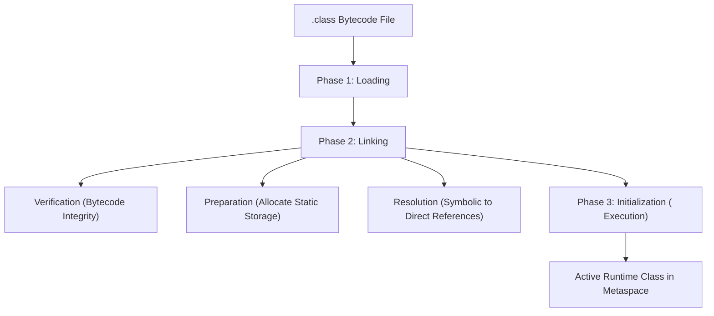

# Lesson 1 — The JVM Architecture, Execution Pipeline & Memory Foundations

> [!NOTE]
> **Learning Outcomes:**
> - Dissect the concentric architecture of the Java platform: **JDK vs JRE vs JVM**.
> - Trace the three-phase ClassLoader lifecycle (**Loading, Linking, Initialization**) and understand parent delegation security.
> - Analyze JVM **Runtime Data Areas** (Metaspace, Stack Frames, and GC Heap) and trace thread-local frame execution.
> - Identify the architectural mechanics of **JIT Tiered Compilation** (Interpreter, C1, and C2 escape analysis).
> - Prevent monetary balance drift by mastering the **IEEE-754 precision limits** and utilizing `BigDecimal`.

{{media:jvm-video}}

{{media:jvm-architecture-visual}}

## Executive Summary & System Context

At the core of professional Software Engineering is the ability to write systems that are platform-independent, performant, and memory-safe. In native languages such as C and C++, source code is compiled directly into platform-specific machine code (ELF binaries on Linux, Mach-O on macOS, PE executables on Windows). This architecture achieves raw CPU execution speed but introduces severe coupling to CPU instruction set architectures (x86_64, ARM64) and operating system kernel system calls.

The **Java Virtual Machine (JVM)** revolutionizes this model by introducing an intermediate abstraction layer. Rather than targeting physical hardware, the Java compiler (`javac`) compiles human-readable `.java` source code into an optimized, platform-agnostic intermediate representation known as **Bytecode** stored in `.class` files. The JVM provides an abstract computing machine complete with an instruction set, memory management, and execution subsystems that executes this bytecode identically across all underlying operating systems.

This lesson explores the JVM specification, its internal subsystem mechanics (ClassLoader, Execution Engine, and Tiered JIT Compilation), the layout of JVM Runtime Data Areas (Metaspace, Stack, Heap), the IEEE-754 floating-point standard, and the low-level bytecode anatomy of Java programs.

---

---

## 1. The Java Platform Architecture: JDK, JRE, and JVM

To design enterprise-grade Java backends, a software engineer must clearly distinguish between the three concentric layers of the Java runtime ecosystem:

```
+-----------------------------------------------------------------------+
| Java Development Kit (JDK)                                            |
| Development Tools: javac, jdb, jshell, javap, jar, jlink, jconsole     |
| +-------------------------------------------------------------------+ |
| | Java Runtime Environment (JRE)                                    | |
| | Core Libraries: java.base, java.sql, java.net, java.util           | |
| | +---------------------------------------------------------------+ | |
| | | Java Virtual Machine (JVM)                                    | | |
| | | ClassLoader Subsystem, Runtime Data Areas, Execution Engine   | | |
| | +---------------------------------------------------------------+ | |
| +-------------------------------------------------------------------+ |
+-----------------------------------------------------------------------+
```

1. **Java Virtual Machine (JVM)**: The abstract runtime engine specified by the JVM Specification. It is responsible for loading `.class` bytecodes, verifying execution safety, allocating system memory, and executing instructions via interpretation or native machine code compilation.
2. **Java Runtime Environment (JRE)**: The bundle containing the JVM plus the standard class libraries (Java Standard Edition Class Library) required to run Java applications. Modern distributions (Java 11+) no longer provide a standalone JRE installer; instead, modular runtimes are created using `jlink`.
3. **Java Development Kit (JDK)**: The comprehensive developer environment that includes the JRE plus development tools such as the compiler (`javac`), disassembler (`javap`), archiver (`jar`), and diagnostic profilers (`jcmd`, `jconsole`, `jvisualvm`).

---

## 2. The Execution Pipeline & ClassLoader Subsystem

When you issue the command `java -cp . com.aastu.Main`, the JVM does not merely read bytes sequentially. It initiates a rigorous three-phase ClassLoader lifecycle:



### 2.1 The ClassLoader Delegation Hierarchy

The JVM enforces the **Parent-Delegation Model** to prevent malicious code from overriding trusted system classes (such as `java.lang.String` or `java.lang.Object`):

1. **Bootstrap ClassLoader**: Written in native C/C++. It loads core runtime classes from `<JAVA_HOME>/jmods/java.base.jmod` (formerly `rt.jar`). It has no parent ClassLoader.
2. **Platform ClassLoader** (formerly Extension ClassLoader): Loads platform-specific extensions and modular runtime components (`java.sql`, `java.desktop`).
3. **Application / System ClassLoader**: Loads classes defined in the application's classpath (`-classpath` or `-cp`) and modulepath.

#### Delegation Algorithm (`loadClass` Mechanics)
When an Application ClassLoader receives a request to load a class:
1. It checks its cache to see if the class has already been loaded.
2. If not cached, it delegates the loading request up to its parent (`Platform ClassLoader`).
3. The parent delegates to the `Bootstrap ClassLoader`.
4. If the parent cannot locate the class, the child finally attempts to locate and load the `.class` byte stream via its `findClass()` method.

> [!IMPORTANT]
> The Parent-Delegation model guarantees security sandboxing. If an attacker injects a rogue `java.lang.System` class into an application JAR, the Application ClassLoader will delegate to the Bootstrap ClassLoader, which loads the genuine JDK class. The malicious override is discarded.

### 2.2 Phase 2: Linking Internals
- **Verification**: The JVM verifies that the byte stream conforms to the JVM specification. It validates that magic numbers match (`0xCAFEBABE`), stack bounds are not violated, variable type safety is preserved, and no uninitialized memory pointers are accessed.
- **Preparation**: Memory is allocated for static fields and initialized to their default values (e.g., `0` for numbers, `false` for booleans, `null` for references). Custom initial values are **not** assigned here.
- **Resolution**: Symbolic references in the runtime constant pool (such as class names, field names, and method signatures) are replaced with direct memory offsets.

### 2.3 Phase 3: Initialization
The JVM executes the static initializer block `<clinit>`:
- Explicit static variable assignments (e.g., `public static int PORT = 8080;`) are executed.
- `static { ... }` blocks run in the textual order they appear in source code.

---

## 3. JVM Runtime Data Areas (Deep Memory Model)

During execution, the JVM manages memory divided into **Thread-Shared** and **Thread-Private** areas:

| Memory Area | Concurrency Scope | Allocation Target | Lifetime | OutOfMemory Risk |
| :--- | :--- | :--- | :--- | :--- |
| **Metaspace** | Shared across all threads | Class metadata, method bytecodes, runtime constant pool, static variables | JVM process lifetime | `java.lang.OutOfMemoryError: Metaspace` |
| **Garbage-Collected Heap** | Shared across all threads | All class instances, arrays, and String Constant Pool (SCP) | Garbage Collector lifetime | `java.lang.OutOfMemoryError: Java heap space` |
| **JVM Stack** | Thread-Private (one per thread) | Stack Frames for active method invocations | Thread lifetime | `java.lang.StackOverflowError` |
| **PC Register** | Thread-Private (one per thread) | Pointer to current JVM bytecode instruction | Thread lifetime | None |
| **Native Method Stack** | Thread-Private (one per thread) | Execution frames for C/C++ native functions (JNI) | Thread lifetime | `StackOverflowError` / Native OOM |

### 3.1 Anatomy of a Stack Frame

Each time a Java thread invokes a method, the JVM pushes a **Stack Frame** onto the thread's stack. When the method completes (returns a value or throws an unhandled exception), the frame is popped and discarded.

A Stack Frame consists of three distinct components:

```
+-----------------------------------------------------------+
| Stack Frame                                               |
| +-------------------------------------------------------+ |
| | 1. Local Variable Array (LVA)                         | |
| |    Index 0: this reference (in instance methods)      | |
| |    Index 1..N: Method parameters & local variables    | |
| |    Slots: 32-bit (1 slot: int, ref; 2 slots: long/dbl)| |
| +-------------------------------------------------------+ |
| | 2. Operand Stack                                      | |
| |    LIFO push/pop workspace for intermediate arithmetic| |
| |    e.g., iload_1, iload_2, iadd, istore_3             | |
| +-------------------------------------------------------+ |
| | 3. Frame Data                                         | |
| |    Constant Pool Resolution, Normal Method Completion | |
| |    Exception Dispatch Table                           | |
| +-------------------------------------------------------+ |
+-----------------------------------------------------------+
```

### 3.2 The Execution Engine: Interpreter vs. JIT Compiler

The JVM Execution Engine employs a **Tiered Compilation** architecture to balance fast application startup with peak high-throughput performance:

1. **Interpreter**: Starts immediately upon JVM launch. It reads bytecode opcodes and interprets them sequentially. While startup latency is minimal, interpretation incurs a significant performance overhead compared to compiled native machine code.
2. **HotSpot Profiler**: As bytecode executes, the JVM continuously monitors runtime statistics. Code that executes frequently (hot methods or loops) is tagged as a "Hot Spot."
3. **C1 Client Compiler**: Compiles hot methods quickly with lightweight optimizations for early acceleration.
4. **C2 Server Compiler**: Invoked for heavily executed code paths. It performs aggressive profile-guided optimizations:
   - **Method Inlining**: Replaces method call overhead with the actual method body.
   - **Escape Analysis**: Determines if an object allocated inside a method escapes the thread. If an object does not escape, the JVM can perform **Scalar Replacement**, allocating its fields directly into CPU registers or stack frames rather than incurring Heap GC allocation!
   - **Loop Unrolling**: Decreases branch checking overhead by expanding loop iterations.

---

## 4. Primitive Types, Memory Representation & Casting Traps

Java enforces strict data typing. The language partitions data into **Primitives** (value types stored directly in stack frames or embedded in heap objects) and **Reference Types** (pointers to objects in the Heap).

### 4.1 Primitive Data Types Matrix

| Type | Size | Default Value | Representation / Range | Engineering Considerations |
| :--- | :--- | :--- | :--- | :--- |
| `byte` | 8 bits (1B) | `(byte) 0` | -128 to +127 (2's complement) | Ideal for raw binary network streams and file I/O buffers. |
| `short` | 16 bits (2B) | `(short) 0` | -32,768 to +32,767 | Rare in enterprise business logic; used in embedded systems. |
| `int` | 32 bits (4B) | `0` | -2^31 to +2^31 - 1 (~2.14 billion) | Standard integer type. Overflow silently wraps around without runtime exception! |
| `long` | 64 bits (8B) | `0L` | -2^63 to +2^63 - 1 | Database primary keys, epoch timestamps, large file offsets. |
| `float` | 32 bits (4B) | `0.0f` | IEEE-754 Single Precision (~7 digits precision) | Fast 3D graphics, machine learning tensors. Never for currency! |
| `double` | 64 bits (8B) | `0.0d` | IEEE-754 Double Precision (~15-17 digits) | Scientific simulations. Never for currency! |
| `char` | 16 bits (2B) | `'\u0000'` | 0 to 65,535 (Unsigned UTF-16 Code Unit) | Represents Unicode Basic Multilingual Plane characters. |
| `boolean` | JVM-dep | `false` | `true` or `false` | In bytecode, individual booleans are compiled as 32-bit `int`s (0 or 1). In boolean arrays, HotSpot uses 8-bit byte elements. |

### 4.2 The IEEE-754 Floating-Point Precision Pitfall

A common disaster in financial software engineering is using `double` or `float` for monetary balances. Consider this code snippet:

```java
double balance = 1.00;
double charge = 0.90;
System.out.println(balance - charge); // Outputs: 0.09999999999999998
```

#### Why does this happen?
The IEEE-754 standard represents numbers in binary scientific notation:
$$	ext{Value} = (-1)^{	ext{sign}} 	imes 1.	ext{mantissa} 	imes 2^{	ext{exponent}}$$

Fractions like $0.1$ ($1/10$) cannot be represented finitely in base-2 binary, just as $1/3$ ($0.3333\dots$) cannot be represented finitely in base-10 decimal. In binary, $0.1$ is an infinite repeating fraction:
$$0.00011001100110011\dots_2$$

Because the 64-bit `double` mantissa is truncated after 52 bits, mathematical rounding errors accumulate, leading to balance drift and audit failures.

#### The Production Solution: `java.math.BigDecimal`
In banking and e-commerce systems (such as CBE, Telebirr, and Stripe), all currency calculations **must** utilize `BigDecimal` with explicit scale and rounding modes:

```java
import java.math.BigDecimal;
import java.math.RoundingMode;

public class FinancialAccounting {
    public static void main(String[] args) {
        // ALWAYS instantiate BigDecimal using String constructors, NOT doubles!
        BigDecimal balance = new BigDecimal("1.00");
        BigDecimal charge = new BigDecimal("0.90");
        
        BigDecimal remaining = balance.subtract(charge);
        System.out.println("Precise Balance: " + remaining); // 0.10

        // Strict division with explicit rounding
        BigDecimal total = new BigDecimal("100.00");
        BigDecimal installments = new BigDecimal("3");
        BigDecimal monthly = total.divide(installments, 2, RoundingMode.HALF_UP);
        System.out.println("Monthly Payment: " + monthly); // 33.33
    }
}
```

### 4.3 Type Conversion & Narrowing Overflow

1. **Widening Conversion (Implicit)**: Automatically handled by the compiler when moving from smaller to larger types (`byte` $	o$ `short` $	o$ `int` $	o$ `long` $	o$ `float` $	o$ `double`). No runtime data loss occurs (except potential loss of least significant bits when converting `long` to `float`).
2. **Narrowing Conversion (Explicit)**: Moving from larger to smaller types requires an explicit cast operator `(targetType)`. The JVM truncates higher-order bits, which can result in unexpected sign inversion:

```java
int largeVal = 130;
byte truncated = (byte) largeVal;
System.out.println("Truncated byte: " + truncated); // Outputs: -126!
```

**Why -126?**
- In binary (32 bits), `130` is: `00000000 00000000 00000000 10000010`.
- Casting to 8-bit `byte` chops off the upper 24 bits, leaving: `10000010`.
- In signed two's complement, a leading `1` denotes a negative number:
  $$	ext{Value} = -128 + 2 = -126$$

---

## 5. Bytecode Disassembly: Anatomy of Java Program Entry Point

Let us analyze the standard Java entry point through the lens of JVM bytecode.

```java
package com.aastu.demo;

public class HelloEngineering {
    public static void main(String[] args) {
        int x = 42;
        int y = 58;
        int sum = x + y;
        System.out.println("Sum: " + sum);
    }
}
```

Compiling with `javac HelloEngineering.java` and inspecting with the disassembler `javap -c -v HelloEngineering.class` reveals the exact JVM opcodes:

```text
public static void main(java.lang.String[]);
  descriptor: ([Ljava/lang/String;)V
  flags: (0x0009) ACC_PUBLIC, ACC_STATIC
  Code:
    stack=3, locals=4, args_size=1
       0: bipush        42        // Push byte constant 42 onto Operand Stack
       2: istore_1                // Pop 42 and store into Local Variable Array slot 1 (x)
       3: bipush        58        // Push byte constant 58 onto Operand Stack
       5: istore_2                // Pop 58 and store into Local Variable Array slot 2 (y)
       6: iload_1                 // Push value of local variable 1 (42) onto Operand Stack
       7: iload_2                 // Push value of local variable 2 (58) onto Operand Stack
       8: iadd                    // Pop two ints, add them (42 + 58 = 100), push result
       9: istore_3                // Pop 100 and store into Local Variable Array slot 3 (sum)
      10: getstatic     #7        // Field java/lang/System.out:Ljava/io/PrintStream;
      13: iload_3                 // Push sum (100) onto Operand Stack
      14: invokedynamic #13, 0    // Invoke StringConcatFactory (Java 9+ invokedynamic)
      19: invokevirtual #17       // Method java/io/PrintStream.println:(Ljava/lang/String;)V
      22: return                  // Return void
```

### Why are the signatures structured this way?
- `public`: The JVM runtime launcher operates outside the class's package boundary and requires unrestricted access to invoke the entry method.
- `static`: When the JVM boots, no instance of the enclosing class has been created on the Heap. Declaring the entry point `static` allows the JVM to invoke the method directly via Class metadata in Metaspace without allocating an unnecessary object.
- `void`: If an application encounters a fatal error, it communicates with the host operating system via `System.exit(int status)` (where `0` denotes success, and non-zero denotes error codes). Returning a value from `main()` is redundant.
- `String[] args`: Accepts command-line parameters passed from the terminal/container environment into the application as an array of strings.

---

## 6. Progressive 3-Tier Interactive Practice

### Level 1: Architecture & Internals Walkthrough
**Challenge**: Trace the state of the JVM Thread Stack and Operand Stack for the following method invocation:
```java
public static int compute(int a, int b) {
    int c = a * 2;
    return c + b;
}
```
Show the Local Variable Array (LVA) indices and explain what happens to the Stack Frame when `compute()` finishes execution.

<details>
<summary>View Level 1 Architectural Walkthrough</summary>

**Step-by-step Trace**:
1. **Invocation**: A new Stack Frame for `compute(int, int)` is pushed onto the calling thread's JVM Stack.
2. **Local Variable Array (LVA)**:
   - Slot 0: Parameter `a` (since this is a `static` method, slot 0 is NOT `this`; it holds the first argument).
   - Slot 1: Parameter `b`.
   - Slot 2: Local variable `c`.
3. **Operand Stack Execution**:
   - `iload_0`: Pushes value of `a` onto Operand Stack.
   - `iconst_2`: Pushes integer literal `2` onto Operand Stack.
   - `imul`: Pops `a` and `2`, multiplies them, and pushes product onto Operand Stack.
   - `istore_2`: Pops product and writes it to LVA slot 2 (`c`).
   - `iload_2`: Pushes `c` onto Operand Stack.
   - `iload_1`: Pushes `b` onto Operand Stack.
   - `iadd`: Pops both, sums them, and pushes result onto Operand Stack.
   - `ireturn`: Pops the final sum, returns it to the caller's frame, and pops the current Stack Frame off the thread stack, reclaiming the frame memory instantly.
</details>

---

### Level 2: Scaffolded System Refactoring
**Scenario**: You are reviewing an e-wallet settlement service deployed in a FinTech startup. The existing code uses primitive `double` and primitive cast operations, causing monetary drift and silent balance corruptions:

```java
// BUGGY LEGACY SERVICE
public class SettlementService {
    public static double computeCommission(double transactionAmount, double rate) {
        return transactionAmount * rate;
    }

    public static byte serializeTransactionCount(int dailyCount) {
        // Intended to serialize count into a compact byte payload
        return (byte) dailyCount;
    }
}
```

**Task**: Refactor `SettlementService` using professional software engineering patterns:
1. Replace floating-point arithmetic with `BigDecimal` and strict financial rounding (`HALF_EVEN` / Banker's Rounding).
2. Protect the serialization method from integer overflow, throwing an `ArithmeticException` or `IllegalArgumentException` if the count exceeds 8-bit bounds.

<details>
<summary>View Level 2 Refactored Production Solution</summary>

```java
package com.aastu.fintech;

import java.math.BigDecimal;
import java.math.RoundingMode;
import java.util.Objects;

public final class SettlementService {

    private SettlementService() {
        // Prevent instantiation of utility class
    }

    /**
     * Computes transactional commission using Banker's Rounding (HALF_EVEN)
     * to eliminate statistical bias over large volumes.
     */
    public static BigDecimal computeCommission(BigDecimal transactionAmount, BigDecimal rate) {
        Objects.requireNonNull(transactionAmount, "Transaction amount cannot be null");
        Objects.requireNonNull(rate, "Rate cannot be null");

        if (transactionAmount.compareTo(BigDecimal.ZERO) < 0 || rate.compareTo(BigDecimal.ZERO) < 0) {
            throw new IllegalArgumentException("Amount and rate must be non-negative");
        }

        // Scale to 4 decimal places for internal ledger calculation, rounded to 2 for final settlement
        return transactionAmount.multiply(rate).setScale(2, RoundingMode.HALF_EVEN);
    }

    /**
     * Safely serializes integer count to byte with strict overflow detection.
     */
    public static byte serializeTransactionCount(int dailyCount) {
        if (dailyCount < Byte.MIN_VALUE || dailyCount > Byte.MAX_VALUE) {
            throw new ArithmeticException("Daily transaction count " + dailyCount + 
                                          " overflows byte storage range (-128 to 127)");
        }
        return (byte) dailyCount;
    }
}
```
</details>

---

### Level 3: Senior SE Systems Challenge (Production Incident)
**Incident Report**: A Spring Boot microservice running on Kubernetes with JVM flags `-Xmx4g -XX:MaxMetaspaceSize=256m` crashes periodically after 48 hours of sustained production traffic.
The pod logs display:
```text
java.lang.OutOfMemoryError: Metaspace
```
Heap usage remains low (< 30% of 4GB), and Garbage Collection logs show frequent Full GC events with zero Metaspace reclamation.

**Diagnostic Investigation**:
1. Why does Metaspace leak memory even when Heap GC is functioning normally?
2. What software patterns (e.g., dynamic proxies, reflection, CGLIB, ByteBuddy, XML parsers) cause Metaspace exhaustion?
3. What JVM command-line flags and debugging tools (`jcmd`, `jstat`) should be used to isolate and remediate the root cause?

<details>
<summary>View Level 3 Senior SE Architectural Diagnostic & Resolution</summary>

### 1. Root Cause Mechanism
Metaspace stores Class Metadata, Method Bytecodes, Constant Pools, and vtables allocated in native OS memory. While standard heap objects are swept away during Minor/Major GC, **classes in Metaspace can only be unloaded if their defining ClassLoader itself is eligible for Garbage Collection**.

If an application continually generates new classes dynamically without reusing ClassLoaders, the ClassLoader references stay rooted in thread locals or singleton registries. Consequently:
- Every dynamic class definition remains pinned in Metaspace indefinitely.
- Even when the Heap has gigabytes of free memory, Metaspace reaches `MaxMetaspaceSize` (256MB), triggering repeated Stop-The-World Full GCs before terminating the JVM process with `java.lang.OutOfMemoryError: Metaspace`.

### 2. Common Engineering Culprits
- **Unbounded Dynamic Proxy Creation**: Frameworks (Spring AOP, Hibernate, Jackson, CGLIB) creating unique proxy classes per request rather than caching proxy classes per type.
- **Leaked Custom ClassLoaders**: Plugins or hot-reloading mechanisms that load new JARs without dereferencing old ClassLoader instances.
- **Groovy / Dynamic Scripting**: Re-compiling Groovy scripts into new `.class` instances on every transaction rather than caching the compiled `Script` object.

### 3. Production Remediation Protocol
1. **Diagnosis with Diagnostic Commands**:
   ```bash
   # Inspect Metaspace allocation by classloader
   jcmd <PID> GC.class_stats
   
   # Track class loading / unloading metrics
   jstat -class <PID> 1000 10
   
   # Dump ClassLoader hierarchy
   jcmd <PID> VM.classloader_stats
   ```
2. **JVM Tuning & Class Dumping**:
   Add diagnostic JVM flags to identify leaking classes:
   ```bash
   -XX:+UnlockDiagnosticVMOptions -XX:+TraceClassLoading -XX:+TraceClassUnloading
   ```
3. **Architectural Remediation**:
   - Cache generated dynamic proxies globally using a `ConcurrentHashMap<Class<?>, Class<?>>`.
   - Ensure dynamic script engines compile templates once at startup or on explicit configuration change.
   - If class volume is legitimately high due to hundreds of micro-modules, increase `-XX:MaxMetaspaceSize=512m` and configure `-XX:MetaspaceSize=256m` (high watermark) to prevent early GC thrashing.
</details>
